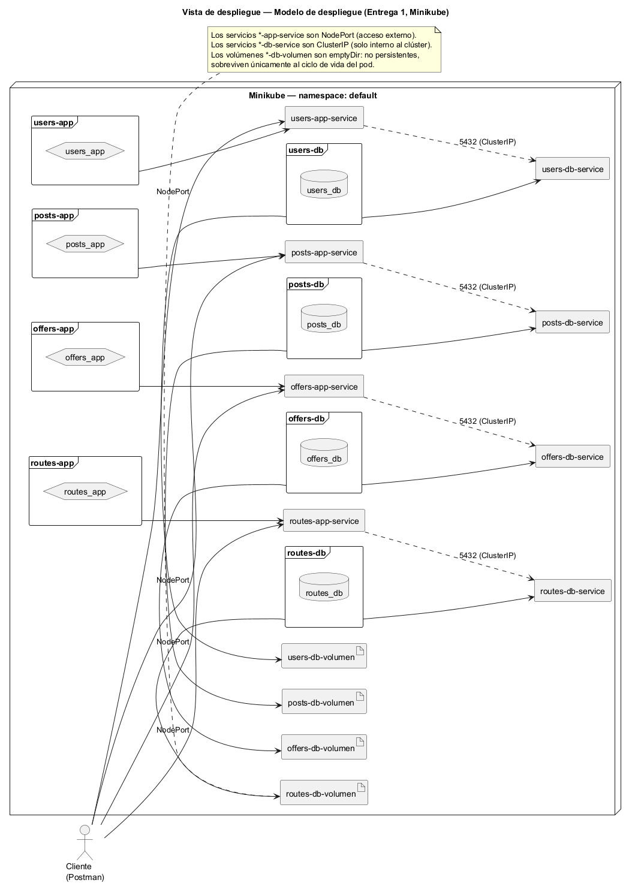
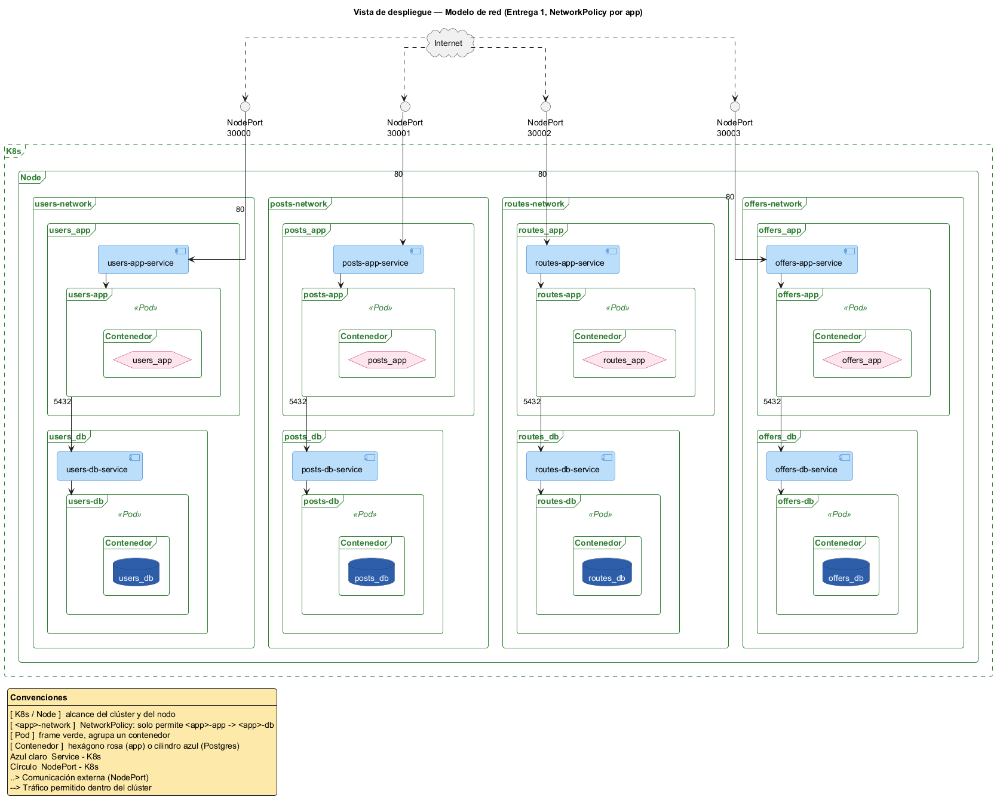

# Vista de despliegue

## Modelo de despliegue

En esta entrega el sistema se despliega sobre un clúster de **Minikube**, en el namespace `default`. Cada aplicación y cada base de datos corren en su propio `Deployment`, con su propio `Service`:

- `<app>-app-service` es tipo **NodePort**: expone la aplicación fuera del clúster.
- `<app>-db-service` es tipo **ClusterIP**: solo alcanzable dentro del clúster, nunca desde afuera.
- Las bases de datos usan volúmenes `emptyDir` (`<app>-db-volumen`): no son persistentes, sobreviven solo mientras vive el pod. Su propósito es resistir un reinicio momentáneo del contenedor, no guardar datos entre despliegues.

Diagrama fuente: [`diagrams/deployment.puml`](./diagrams/deployment.puml).

En la primera entrega las cuatro aplicaciones están completamente desacopladas y no tienen comunicación entre ellas (ver [vista funcional](./functional.md)). Las bases de datos se despliegan bajo el mismo modelo que las aplicaciones; correrán en un motor administrado en entregas futuras.

## Modelo de red

Cada aplicación tiene una `NetworkPolicy` propia (`<app>-network`) que solo permite tráfico de ingreso a su base de datos desde el pod de su propia aplicación, por el puerto `5432`. Cualquier otra combinación (por ejemplo, `posts-app` intentando conectarse a `users-db`) está bloqueada por defecto, ya que no existe ninguna regla que la autorice.

Diagrama fuente: [`diagrams/networks.puml`](./diagrams/networks.puml).

Esto garantiza que, aunque las cuatro aplicaciones y sus bases de datos compartan el mismo clúster y namespace, cada una mantiene aislamiento total sobre sus propios datos.
