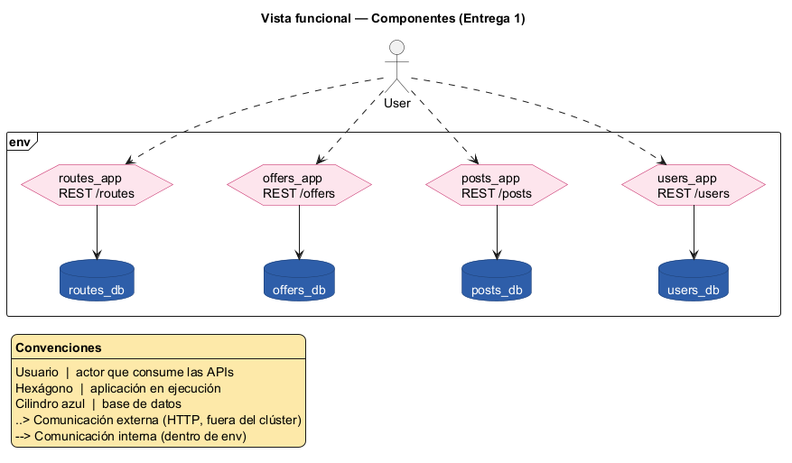

# Vista funcional

El sistema está compuesto por cuatro aplicaciones en ejecución, cada una un componente independiente que expone su propia API REST y administra su propia base de datos. Esta es la primera iteración del sistema: no representa todos los componentes que tendrá el proyecto a futuro.

Diagrama fuente: [`diagrams/components.puml`](./diagrams/components.puml).

| Componente | Responsabilidad | Base de datos | Documentación de la API |
|---|---|---|---|
| `users_app` | Registro, autenticación y perfil de usuarios | `users_db` | [users_app/README.md](https://github.com/MISW-4301-Desarrollo-Apps-en-la-Nube/202614-grupo24-proyecto/blob/main/users_app/README.md) |
| `routes_app` | Trayectos disponibles para envío | `routes_db` | [routes_app/README.md](https://github.com/MISW-4301-Desarrollo-Apps-en-la-Nube/202614-grupo24-proyecto/blob/main/routes_app/README.md) |
| `posts_app` | Publicaciones de envío sobre un trayecto | `posts_db` | [posts_app/README.md](https://github.com/MISW-4301-Desarrollo-Apps-en-la-Nube/202614-grupo24-proyecto/blob/main/posts_app/README.md) |
| `offers_app` | Ofertas de transporte sobre una publicación | `offers_db` | [offers_app/README.md](https://github.com/MISW-4301-Desarrollo-Apps-en-la-Nube/202614-grupo24-proyecto/blob/main/offers_app/README.md) |

## Cohesión y acoplamiento

- Cada aplicación es dueña exclusiva de su información: ninguna accede directamente a la base de datos de otra.
- En esta entrega las cuatro aplicaciones están **completamente desacopladas**: no hay llamadas entre componentes. Por ejemplo, `posts_app` no valida contra `routes_app`/`users_app` que el `routeId`/`userId` recibido exista; solo valida formato.
- Todas exponen los mismos endpoints técnicos por contrato: `GET /ping` (salud) y `POST /reset` (limpieza de datos), usados por los pipelines de evaluación.
- Todas comparten arquitectura hexagonal (dominio / puertos / adaptadores / entrypoints), Python 3.11 + FastAPI, y PostgreSQL como motor de base de datos. Ver la [vista de desarrollo](./development.md) para el detalle de tecnologías.
