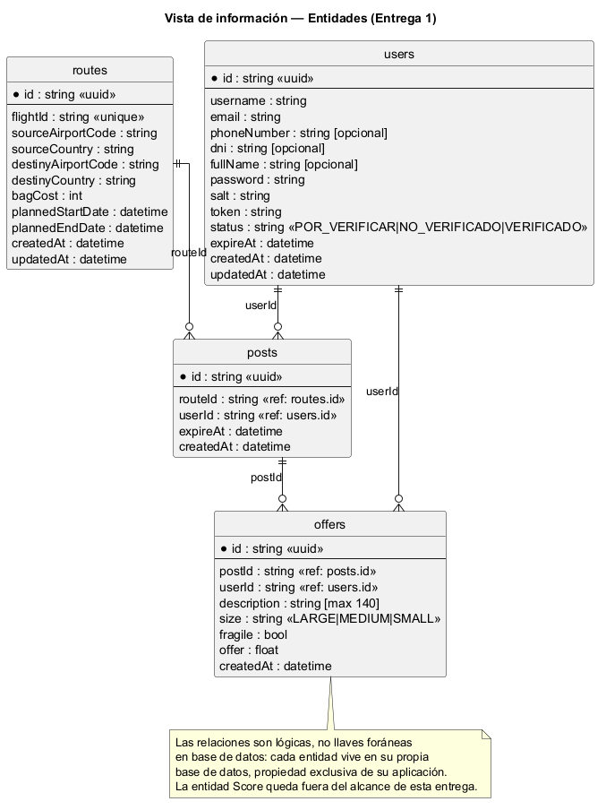

# Vista de información

El sistema administra cuatro entidades, cada una propiedad exclusiva de la aplicación que la gestiona. Ninguna aplicación accede directamente a la base de datos de otra: toda relación entre entidades de distintas apps (por ejemplo, una publicación con su trayecto) se resuelve por id, sin llave foránea real en base de datos.

Diagrama fuente: [`diagrams/entities.puml`](./diagrams/entities.puml).

## Entidad `users` (`users_app`)

| Campo | Tipo | Descripción |
|---|---|---|
| id | string (uuid) | Identificador del usuario |
| username | string | Nombre de usuario, sin espacios ni caracteres especiales |
| email | string | Correo electrónico |
| phoneNumber | string (opcional) | Teléfono de contacto |
| dni | string (opcional) | Documento de identidad |
| fullName | string (opcional) | Nombre completo |
| password | string | Password cifrado |
| salt | string | Sal usada para el cifrado del password |
| token | string | Token de sesión actual |
| status | string | `POR_VERIFICAR`, `NO_VERIFICADO` o `VERIFICADO` |
| expireAt | datetime | Vencimiento del token generado |
| createdAt | datetime | Fecha de creación |
| updatedAt | datetime | Fecha de última actualización |

## Entidad `routes` (`routes_app`)

| Campo | Tipo | Descripción |
|---|---|---|
| id | string (uuid) | Identificador del trayecto |
| flightId | string (único) | Identificador del vuelo, p. ej. `AA001` |
| sourceAirportCode | string | Código IATA del aeropuerto de origen |
| sourceCountry | string | País de origen |
| destinyAirportCode | string | Código IATA del aeropuerto de destino |
| destinyCountry | string | País de destino |
| bagCost | int | Costo de envío de una maleta en el trayecto |
| plannedStartDate | datetime | Inicio planeado del trayecto |
| plannedEndDate | datetime | Fin planeado del trayecto |
| createdAt | datetime | Fecha de creación |
| updatedAt | datetime | Fecha de última actualización |

## Entidad `posts` (`posts_app`)

| Campo | Tipo | Descripción |
|---|---|---|
| id | string (uuid) | Identificador de la publicación |
| routeId | string | Id del trayecto asociado (`routes`) |
| userId | string | Id del usuario dueño de la publicación (`users`) |
| expireAt | datetime | Fecha máxima en que se reciben ofertas |
| createdAt | datetime | Fecha de creación |

## Entidad `offers` (`offers_app`)

| Campo | Tipo | Descripción |
|---|---|---|
| id | string (uuid) | Identificador de la oferta |
| postId | string | Id de la publicación asociada (`posts`) |
| userId | string | Id del usuario que ofrece transportar el paquete (`users`) |
| description | string (máx. 140) | Descripción del paquete |
| size | string | `LARGE`, `MEDIUM` o `SMALL` |
| fragile | bool | Si el paquete es delicado |
| offer | float | Valor de la oferta en dólares |
| createdAt | datetime | Fecha de creación |

{: .note}
La entidad `Score` está fuera del alcance de esta primera entrega.
